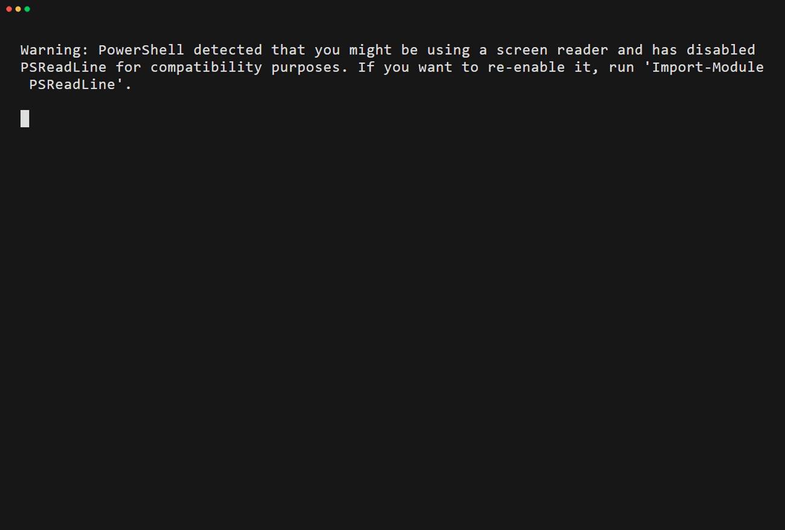
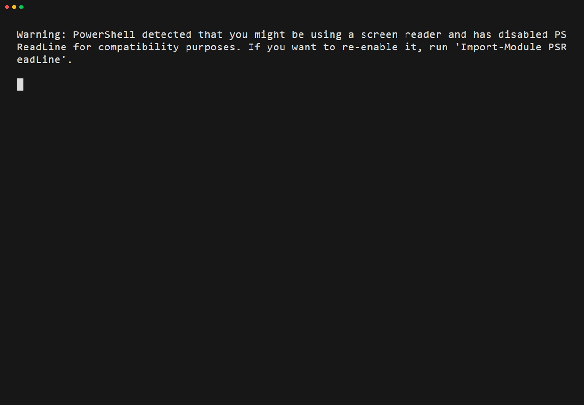

# agentic-board

**Run coding agents off your real GitHub Projects board — a quota-aware, review-gated
coordinator, not another local Kanban.**

<p align="center">
  
</p>

<p align="center"><em>Install it, then just talk to your board:</em></p>

<p align="center">
  
</p>

agentic-board is a Claude Code plugin for developers who track work on GitHub Projects and want
an agent to actually *do* the board work: pick the next issue, start it on its own branch and
worktree, take it through a PR and a review gate, and merge it — across multiple GitHub accounts,
always with a confirmation before anything destructive.

Ask in plain language — *"what's pending?", "start issue #42", "move these to Done", "add
everything labeled `bug`", "close the stale ones"* — or just run `/board work` and let it drive
the whole issue → branch → PR → gate → merge loop.

### What makes it different

- **Your real board, not a local clone.** It drives the GitHub Projects (v2) and Issues APIs
  through the `gh` CLI — the same board your team already uses, not a throwaway Kanban in a tab.
- **A quota-aware multi-CLI fleet.** `/board work` can start several independent issues at once,
  each in its own git worktree, and optionally launch one agent session per issue — probing each
  CLI (Claude, Gemini, Codex, Jules, Copilot) for quota and availability before handing it work.
- **Review-gated by default.** Every issue finishes through a PR and a review gate (Copilot
  review + CI checks + unresolved-thread checks) before it can merge. Good GitHub hygiene is
  driven by the flow, not left to willpower.

> **See it run on itself → [SHOWCASE.md](SHOWCASE.md)** — the tool governs its own roadmap board;
> every fix was found while using it and tracked in the open (the dogfooding loop).

BI GitOps (PBIP/Fabric, TMDL diff review, semantic-model agents) is a **future module** on the
same foundation — see the [roadmap](#module-roadmap).

---

## Why

Teams track their work on GitHub Projects, but the board work stays manual: creating fields,
moving cards, bulk-triaging issues, wiring CI automation, then babysitting each change through
its branch, PR, and merge. This plugin turns those chores into natural-language requests an agent
executes consistently — including the GitHub gotchas (single-select field IDs, native sub-issues,
`gh project delete` having no `--yes` flag) that are easy to get wrong by hand.

---

## Install

```
/plugin marketplace add CSalcedoDataBI/agentic-board
/plugin install agentic-board
```

Then enable **agentic-board** in your Claude Code plugins.

> **Migrating from `agentic-bi-ops`?** The plugin was renamed to **`agentic-board`**
> (the GitHub repo redirects automatically). Existing installs keep updating via a
> deprecated `agentic-bi-ops` alias in the marketplace, but to move to the new name
> refresh the marketplace and install the new id:
>
> ```
> /plugin marketplace update CSalcedoDataBI/agentic-board
> /plugin install agentic-board@agentic-board
> ```

---

## Quick start

After installing, use the `/board` command or just ask:

```
/board work                      # the daily driver: see pending work, pick an issue, start it
/board init                      # create a Projects board and link it to this repo
/board add #42                   # add issue #42 to the board
/board move #42 to Done          # set an item's Status
/board fill                      # detect + fill board gaps (assignees, Status, Priority, ...)
/board bulk close label:stale    # batch-close (shows a dry-run + asks first)
/board automate                  # install the CI workflow that auto-adds issues/PRs
/board templates                 # install issue forms + PR template into the repo
/board labels                    # apply the label taxonomy (bug/docs/refactor/chore/blocked/...)
/board update                    # post a high-level status update on the board
/board handoff                   # save/resume context to continue in another session (days later)
```

---

## The command model

agentic-board follows the **noun-verb** convention used by `git`, `gh`, `docker`, and `kubectl`
([clig.dev](https://clig.dev/)): a few command **"nouns"**, with **verbs as arguments**. You learn
one door, not a wall of commands.

<!-- BEGIN:commands - generated by Update-Docs.ps1 from each command's frontmatter; do not edit by hand -->
| Command | What it does |
|---|---|
| `/board` | Administer/automate a GitHub Projects board — verbs work/plan/fill/init/add/move/field/bulk/automate/templates/labels/update/changelog/handoff/doctor. Defaults to the CSalcedoDataBI account. |
| `/knowledge` | Manage the project knowledge references registry by domain (add/harvest/list/gen/wiki). Versioned in knowledge/registry.json + generated KNOWLEDGE.md. |
| `/scan` | Scan the CURRENT project for untracked work (code TODOs, doc checklists/pending, plans/specs) and turn the chosen items into issues + a board plan. Targets the current repo, not the tool's. |
| `/skills` | Manage the Agent Skills lifecycle — organize/catalog, audit for failures, bootstrap best-practice toolkits by profile (quality or bi = Microsoft Fabric / Power BI), or check installed-tool freshness. Part of the skills-ops module. |
<!-- END:commands -->

Two rules keep it discoverable, so nothing has to be memorized:

- **No args → a menu.** Run a command with nothing after it (just `/board`) and it lists its own
  verbs.
- **One front door.** `/board` also points to the sibling commands, so the whole tool is reachable
  from a single entry point.

The internal skills (account resolution, board admin, and the rest) are hidden from the `/` palette
— the four commands above are the only entry points you type.

---

## Session handoff

Stop mid-task and pick it up in a **fresh session days later — even on another machine** —
without re-typing the context. `/board handoff` saves a *curated, verified* snapshot and reads
it back:

```
/board handoff save     # snapshot: the last important thing + the concrete next step + traps
/board handoff resume    # rehydrate that context and continue the linked issue
```

- **Durable, board-linked, cross-machine.** The source of truth is a pinned `[abios-handoff]`
  comment on the linked issue (no `main` noise), mirrored to a gitignored `HANDOFF.md`.
- **Verified, not hand-waved.** Every claim is tagged `[V]` (re-checked live this run) or `[?]`
  (from memory); resume reports **drift** (branch gone, PR merged) and carries **traps** forward.
- **Surfaces itself.** `/board handoff save` drops a self-cleaning `MEMORY.md` pointer; an opt-in
  SessionStart hook (`references/handoff-hook.md`) announces the handoff when you resume.
- **Heavy case, done safely.** For persistent *semantic* memory, `Suggest-HeavyMemory.ps1`
  proposes installing **Basic Memory** (upstream, AGPL) under a full security gate — never
  vendored. The lightweight `HANDOFF.md` stays the default. See `references/heavy-memory.md`.

Design + reference: `plugins/agentic-board/skills/projects-admin/references/handoff.md`.

### Knowledge vs memory vs handoff

Three markdown surfaces, one job each:

| File | Holds | Lifetime |
|------|-------|----------|
| `MEMORY.md` | facts the agent recalls across sessions | permanent, the agent's |
| `HANDOFF.md` | how to resume one task | ephemeral, one task |
| `KNOWLEDGE.md` | catalog of external references by domain (`/knowledge`) | permanent, yours |

---

## Parallel work sessions

`/board work` can start **several independent issues at once**, each in full isolation — the
official multi-session pattern built on **git worktrees**:

```
/board work                      # pick MORE THAN ONE pending issue to batch-start
# or drive the script directly (path relative to a repo checkout):
plugins/agentic-board/scripts/Board-Work.ps1 -ProjectNum <n> -Parallel 12,14,15 -Launch
```

For each issue the batch:

1. Moves it to **In Progress**, assigns you, and posts a `[abios-claim]` fingerprint.
2. Creates a **git worktree** on its own branch `issue-<n>-<slug>`, branched off a fresh
   `origin/main`. All worktrees are grouped under one sibling folder so the parent dir stays clean:

   ```
   Repos/
     agentic-board/                     ← your main working copy (untouched)
     agentic-board--worktrees/          ← one folder holds the whole fleet
       issue-129/   [issue-129-…]         ← session A
       issue-130/   [issue-130-…]         ← session B
   ```

   They share a single `.git`, so N working directories edit in parallel without colliding.
3. With `-Launch`, opens **one Windows Terminal tab per worktree** running an autonomous headless
   `claude -p` session, each briefed to take its issue all the way through **PR → review gate →
   merge**.

Monitor the fleet with `plugins/agentic-board/scripts/Board-Work.ps1 -Sessions` (dead-PID entries
are pruned automatically).
Use `-DryRun` to preview without mutating or spawning. After a PR merges, clean its worktree with
`git worktree remove`. Only parallelize issues that don't depend on each other. Tabs require
Windows Terminal (`wt`); without it, each session opens in a standalone `pwsh` window.

---

## Setup

1. Install and authenticate the [`gh` CLI](https://cli.github.com/).
2. Provide a GitHub **Personal Access Token** (classic) with the `project` and `repo`
   scopes. The plugin reads it from an environment variable so the token never lives in the repo.

**Multi-account model.** The plugin resolves *which* account to act as, then reads that
account's token from a per-account environment variable — it never calls `gh auth switch`, so
your global `gh` state is left untouched. Configure one variable per account you use:

| Account role | Env variable | Default? |
|---|---|---|
| Primary (personal) | `GITHUB_TOKEN_PERSONAL` | ✅ used unless overridden |
| Secondary (work/org) | `GITHUB_TOKEN_BUSINESS` | used with `--account` override |

> The shipped defaults map the primary account to **CSalcedoDataBI** and the secondary to
> **PAL-Devs**. To adapt the plugin to your own accounts, edit the small map at the top of
> `scripts/Get-GhAccount.ps1` and the matching note in `skills/gh-account/SKILL.md`.

**Platform.** Token resolution reads the Windows user environment via PowerShell. On
macOS/Linux, export `GH_TOKEN` yourself before running board ops — the `gh` recipes themselves
are cross-platform.

---

## What's inside

| Component | Purpose |
|---|---|
| `gh-account` skill | Resolves the active account and injects its token per-operation. The shared foundation for every module. |
| `projects-admin` skill | Board + issue governance: fields, item moves, bulk ops, CI auto-add — with dry-run safety on destructive actions. |
| `abios-feedback` skill | Capture tool improvements found while working in any project, sanitized so private data never leaks back here. |
| `project-scan` skill | Scan the CURRENT project for untracked work (code TODOs, doc checklists/pending, plans/specs) and turn chosen items into issues + a board plan. |
| Field presets | One-step localized governance fields (Status/Priority/Type/Area/Estimate/Target) in EN or ES. |
| `/board`, `/scan` commands | Natural-language entry points for the above. |

---

## Contributing safely (private → public)

This tool improves itself: most fixes are discovered while using it inside **private** projects.
The hard rule is that the cause may be private, but the contribution must be public-only.

Two layers protect this repo:

1. **Discipline** — the `abios-feedback` skill captures each improvement abstracted to the public
   tool (no repo names, client names, data, GUIDs, or paths).
2. **A guard you can't forget** — after cloning, run once:
   ```
   powershell -File scripts/install-guard.ps1
   ```
   This wires a `pre-commit` + `pre-push` hook that **blocks** any commit/push whose added lines
   contain a known secret pattern or a term from your local `.abios/private-denylist.txt`
   (gitignored — never committed). Seed that file with your own private fingerprints.

It's defense-in-depth, not a guarantee: a denylist only catches terms you list, so keep layer 1
honest. Override (`--no-verify`) only for a confirmed false positive.

---

## GitHub best practices — enforced by design

The `/board work` flow doesn't just *allow* good GitHub hygiene — it **enforces** it. Checked
against the official guides ([Projects](https://docs.github.com/en/issues/planning-and-tracking-with-projects/learning-about-projects/best-practices-for-projects),
[GitHub flow](https://docs.github.com/en/get-started/using-github/github-flow),
[Pull requests](https://docs.github.com/en/pull-requests/collaborating-with-pull-requests/getting-started/best-practices-for-pull-requests),
[Issues](https://docs.github.com/en/issues/tracking-your-work-with-issues/configuring-issues/planning-and-tracking-work-for-your-team-or-project)):

| Official practice | How the tool enforces it |
|---|---|
| Branch per change, descriptive name | `work` creates `issue-<num>-<slug>` on start |
| PR for every change, issue auto-closed | step 5 mandates a PR with `Closes #<num>` — never direct to main |
| Right identity per repo | `New-BoardPR.ps1` resolves the account from the repo OWNER, pushes with a one-shot credential (remote never rewritten), opens/updates the PR |
| Merge only after review | **review gate**: Copilot review request + CI checks + unresolved threads; exit 0 gates the merge; honest self-review fallback |
| Small, focused PRs | gate warns over 600 lines / 20 files and suggests a sub-issue split |
| Delete branch after merge | merge flow uses `--delete-branch` |
| Break down large issues | `Board-Breakdown.ps1` creates native sub-issues (progress column fills itself) |
| Custom-field metadata | field presets + `Board-Fill` (assignees, Status, Priority, Size, Type) |
| Issue templates & labels | `/board templates` (forms + PR template) and `/board labels` (taxonomy) |
| Status updates | `/board update` posts high-level progress on the board |
| Dependencies respected | `[BLOCKED]` items are flagged and refused by `-Start` |
| Single source of truth | one board ⇄ one repo, resolve-before-create, backup-before-delete |

Honestly out of scope (GitHub exposes no API): view layouts, charts/insights, project templates.

---

## Toolkit provisioning (skills-ops)

agentic-board doesn't rebuild the BI tooling ecosystem — it **references, installs, and
monitors** the tools that already exist, so a Fabric / Power BI project gets the right toolkit
without reinventing anything. Zero weight for non-BI users: it's a curated JSON catalog plus a
couple of scripts that only run when you invoke a profile.

**Profiles** (`presets/toolkits/<profile>.json`):

| Profile | Provisions |
|---|---|
| `quality` (default) | Skill-authoring / review toolkit |
| `bi` | Microsoft Fabric + Power BI ecosystem — task bundles `semantic-model-review`, `fabric-app`, `data-agent` |

**Commands:**

- `/skills bootstrap bi` — install the gaps for a profile (never duplicating what's already
  installed). Detects by kind: a `skill-clone` folder is clean-cloned with its LICENSE; a
  `plugin` surfaces its own install command.
- `/skills freshness` — report-only: compares each installed skill's recorded commit SHA against
  upstream and flags `fresh` / `behind` / `unknown`. It never reinstalls — you decide.

**Catalogued tools (attribution).** Every tool keeps its owner and license; nothing is vendored:

| Tool | Owner | License | Profile |
|---|---|---|---|
| [skills-for-fabric](https://github.com/microsoft/skills-for-fabric) | Microsoft | MIT | `bi` |
| [skill-creator](https://github.com/anthropics/skills) | Anthropic | See repo | `quality` |
| [writing-skills](https://github.com/obra/superpowers) | obra | MIT | `quality` |
| [skill-improver](https://github.com/trailofbits/skills) | Trail of Bits | CC BY-SA 4.0 | `quality` |
| [second-opinion](https://github.com/trailofbits/skills) | Trail of Bits | CC BY-SA 4.0 | `quality` |

Add your own public repos (or another developer's) as `skill-clone` entries in
`presets/toolkits/bi.json` — always with owner + license. Schema: `presets/toolkits/README.md`.

---

## Module roadmap

| Module | Description | Foundation |
|---|---|---|
| **M1** (current) | Cross-account GitHub Projects & issues governance | `gh-account` |
| **M2** (shipped) | **TMDL diff review** — breaking schema-change detection wired into the review gate (the surviving slice of the old PBIP/Fabric git-ops idea) | `tmdl-review` |
| **M3** (current) | **BI toolkit provisioning** — *reference / install / monitor* the Microsoft Fabric + Power BI tooling ecosystem by profile (`/skills bootstrap bi`, `/skills freshness`), rather than rebuild it. See [Toolkit provisioning](#toolkit-provisioning-skills-ops) | `skills-ops` |
| **M4** (in progress) | BI release automation — a **release checklist spec for BI artifacts** (`references/bi-release-checklist.md`) and **changelog generation** from board Done issues (`/board changelog`) | `gh-account` |
| **M5** | Knowledge-ops — per-project references registry by domain (`knowledge/registry.json` + generated `KNOWLEDGE.md`), `/knowledge add` + `harvest`; Phase 2 wiki publish + capture-in-handoff | `gh-account` |

---

## License

MIT — see [LICENSE](./LICENSE).

---

<sub>agentic-board <!-- BEGIN:version -->v0.23.0<!-- END:version --> · docs generated by `plugins/agentic-board/scripts/Update-Docs.ps1`</sub>
