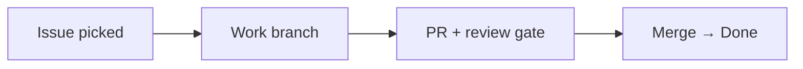
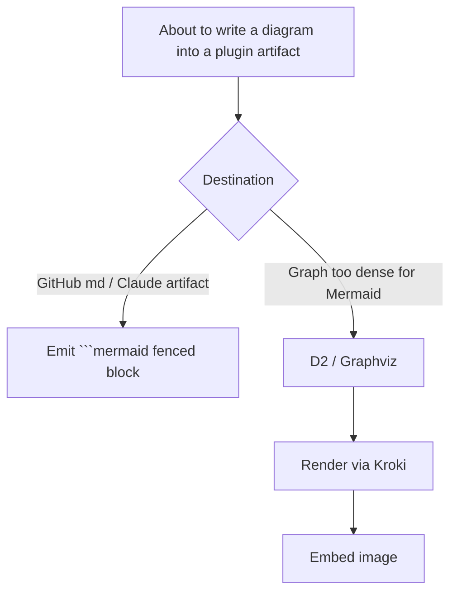

# diagram-authoring — Mermaid over ASCII

The single source of truth for **how this plugin draws diagrams**. The plugin writes markdown
artifacts (`/board plan` docs, epic/issue bodies, handoffs, status updates, `KNOWLEDGE.md`,
README, blog entries). Their destinations — GitHub markdown and Claude Code / claude.ai
artifacts — render **Mermaid** natively, so a proper diagram-as-code block costs nothing extra
and reads far better than ASCII.

## Core rule

When you are about to put a diagram into any plugin-produced markdown artifact, emit a fenced
**Mermaid** block. **Never hand-draw ASCII art for a graph** (boxes of `+--+`, `│`, `└──▶`).
ASCII diagrams wrap badly, don't diff, and don't scale.

````

````

## Decision table — diagram type → Mermaid syntax

| You are showing… | Use | Header keyword |
|---|---|---|
| A flow / pipeline / decision path | flowchart | `flowchart TD` / `LR` |
| Messages between actors over time | sequence | `sequenceDiagram` |
| States and transitions | state machine | `stateDiagram-v2` |
| Entities and their relations | ER model | `erDiagram` |
| A schedule / timeline | gantt | `gantt` |
| A tree / hierarchy | flowchart (top-down) | `flowchart TD` |

Pick the type that matches the thing being documented — a flow is not a sequence, a hierarchy
is not an ER model.

## Escalation — when Mermaid is not enough

Reach for **D2 (Terrastruct)** or **Graphviz/DOT** only when a graph is too dense for Mermaid to
stay legible (large dependency graphs, many crossing edges). These need an **external render** —
they do not display inline on GitHub. Render via **Kroki** (`https://kroki.io/`) to an SVG/PNG and
embed the image, rather than pasting source no destination will draw. If no render path is
available, fall back to a simpler Mermaid approximation — never ship ASCII art as the fallback.

## Anti-invention rule

A diagram documents the **real system**. Do not invent nodes, edges, states, or actors to make a
picture look complete. Every box and arrow must correspond to something that actually exists in
the code, flow, or data being described — read the source first (same discipline as the global
Vega field rules). If you are unsure a relationship exists, leave it out or ask.

## Validation checklist (before saving)

- [ ] The fenced block is opened with ` ```mermaid ` and **closed** with ` ``` `.
- [ ] Node IDs have **no spaces** (`workBranch`, not `work branch`) — quote labels instead:
      `A["work branch"]`.
- [ ] Arrows use valid syntax for the chosen diagram (`-->`, `-.->`, `==>`; `->>` / `-->>` in
      sequence diagrams).
- [ ] `subgraph` / `end` and every `[`, `(`, `{`, `"` are balanced.
- [ ] The diagram reflects the real system (anti-invention rule) — no placeholder nodes.
- [ ] When in doubt it parses, render once (a Claude artifact or Kroki) to confirm before saving.

## Data flow



## Relation to other skills

- Artifact-producing skills (`projects-admin` for `/board plan` + handoff, `knowledge-registry`)
  carry a one-line pointer here so the rule fires without being duplicated — this file stays the
  only place the diagram guidance lives.
- The **Diagrams** knowledge domain (`knowledge/registry.json`) catalogues the tools referenced
  above (Mermaid, D2, Graphviz, Kroki). Graphify is a separate knowledge-graph tool, catalogued
  but not a diagram authoring tool.
